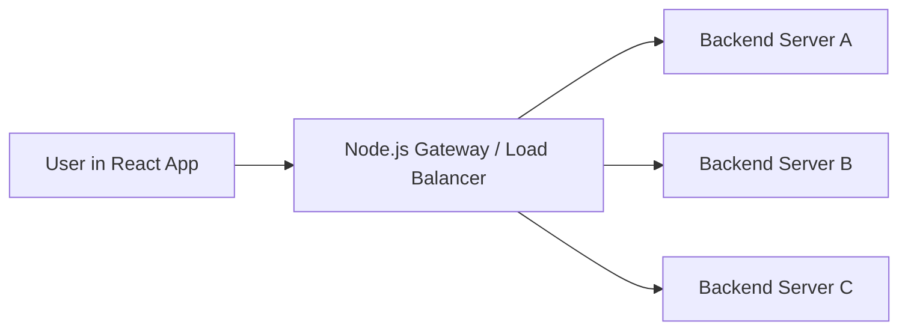

# React + Node.js Demo: Load Balancing with a Real Example

## Why this concept matters
Imagine a video platform like YouTube during a live event. Millions of users open the app and hit the same API tier at once. If every request lands on a single server, that server becomes overloaded, latency spikes, and failures spread. A load balancer sits in front of multiple application servers and distributes requests so the system stays responsive.

This is one of the first ideas to understand in system design because it connects directly to scaling, availability, and fault tolerance.

## Real-world scenario
We will model a simplified **video feed API**:

- Users open a React app
- The React app sends requests to a Node.js gateway
- The gateway forwards traffic to one of multiple backend servers
- A load-balancing strategy decides which server should handle each request

## What you will learn
By the end of this example, you should understand:

1. why a single server becomes a bottleneck
2. how round-robin distribution works
3. what happens when one backend becomes slow or unavailable
4. why health checks and failover matter
5. the trade-offs between simple and advanced balancing strategies

## Architecture at a glance



## Request flow step by step

1. A user opens the frontend.
2. The React app requests `/api/feed`.
3. The Node.js gateway receives the request.
4. The gateway chooses one backend using a balancing rule.
5. The selected backend returns the response.
6. The gateway sends the result back to the client.

## Minimal Node.js example

### Backend servers

```js
const express = require('express');

function createServer(name, port, delay = 0) {
  const app = express();

  app.get('/feed', async (req, res) => {
    await new Promise(resolve => setTimeout(resolve, delay));
    res.json({
      server: name,
      message: `Response from ${name}`,
      delay
    });
  });

  app.listen(port, () => {
    console.log(`${name} running on port ${port}`);
  });
}

createServer('server-a', 4001, 100);
createServer('server-b', 4002, 300);
createServer('server-c', 4003, 50);
```

### Gateway with round robin

```js
const express = require('express');
const axios = require('axios');

const app = express();

const servers = [
  'http://localhost:4001/feed',
  'http://localhost:4002/feed',
  'http://localhost:4003/feed'
];

let current = 0;

app.get('/api/feed', async (req, res) => {
  const target = servers[current];
  current = (current + 1) % servers.length;

  try {
    const response = await axios.get(target);
    res.json({
      strategy: 'round-robin',
      target,
      data: response.data
    });
  } catch (error) {
    res.status(500).json({ error: 'Backend request failed' });
  }
});

app.listen(5000, () => {
  console.log('Gateway running on port 5000');
});
```

### React client

```jsx
import { useState } from 'react';
import axios from 'axios';

export default function App() {
  const [responses, setResponses] = useState([]);

  const fetchFeed = async () => {
    const res = await axios.get('http://localhost:5000/api/feed');
    setResponses(prev => [res.data, ...prev].slice(0, 10));
  };

  return (
    <div style={{ padding: 24, fontFamily: 'sans-serif' }}>
      <h1>Load Balancing Demo</h1>
      <button onClick={fetchFeed}>Send Request</button>
      <ul>
        {responses.map((item, index) => (
          <li key={index}>
            {item.data.server} handled request with {item.data.delay}ms delay
          </li>
        ))}
      </ul>
    </div>
  );
}
```

## What this demonstrates in real time
If you click the button repeatedly, the request should rotate across:

- `server-a`
- `server-b`
- `server-c`

That is the core idea of **round-robin load balancing**.

## What happens when traffic increases?
Round robin is simple, but it does not understand server health or current load.

Example issues:

- `server-b` may be slower than the others
- one server may be down
- some requests may be more expensive than others
- sticky sessions may be needed for login state

In production, a real load balancer often adds:

- health checks
- weighted routing
- least-connections strategy
- timeout and retry logic
- circuit breaking
- regional routing

## Trade-offs

| Strategy | Good for | Weakness |
|---|---|---|
| Round robin | Simple equal distribution | Ignores current server load |
| Weighted round robin | Uneven server capacity | Needs tuning |
| Least connections | Dynamic traffic patterns | More coordination overhead |
| Hash-based routing | Session affinity | Risk of uneven distribution |

## Interview angle
If asked this in an interview, explain it like this:

- Start with the problem: one app server cannot handle growing traffic.
- Introduce a load balancer in front of multiple stateless servers.
- Mention distribution algorithms.
- Add health checks and auto-scaling.
- Call out trade-offs like sticky sessions and uneven request cost.

## Best way to extend this lesson
A good next version of this demo would let the learner:

1. toggle between round robin and least connections
2. simulate a server failure
3. mark a node unhealthy
4. visualize request counts per backend
5. compare latency across strategies

## Suggested repo direction
This file can become the first in a practical series such as:

- load-balancing-demo.md
- caching-demo.md
- queue-processing-demo.md
- rate-limiter-demo.md
- retry-storm-demo.md

Each one can use:

- a real product scenario
- a React frontend
- a Node.js backend
- diagrams
- code
- trade-offs
- interview framing

## Summary
This example teaches the basic intuition behind load balancing using a realistic Node.js gateway and multiple backend servers. It is simple enough to run locally, but close enough to real production thinking to build strong system design instincts.
